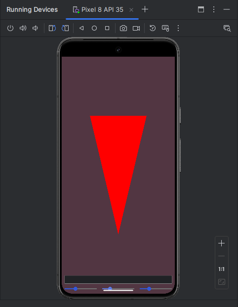

# Example of building android app with iced

Based on several other examples:
 - [na-mainloop](https://github.com/rust-mobile/android-activity/tree/v0.6.0/examples/na-mainloop)
   from `android-activity`
 - [na-winit-wgpu](https://github.com/rust-mobile/rust-android-examples/tree/main/na-winit-wgpu)
   from `rust-android-examples`
 - [integration](https://github.com/iced-rs/iced/tree/0.12.1/examples/integration)
   from `iced`


## Preview




## Building and running

Check `android-activity` crate for detailed instructions.
During my tests I was running the following command and using android studio afterwards:

```bash
export ANDROID_NDK_HOME="path/to/ndk"
export ANDROID_HOME="path/to/sdk"

rustup target add x86_64-linux-android
cargo install cargo-ndk

cargo ndk -t x86_64 -o app/src/main/jniLibs/  build
```


My setup is the following:
- archlinux 6.9.6
- jdk-openjdk 22
- target api 35


## How it works

Thanks to `android-activity` we can already build android apps in Rust, and
key crates such as `winit` and `wgpu` also support building for android.
`iced` doesn't support android out of the box, but it can be integrated with
existing graphics pipelines, as shown in
[integration](https://github.com/iced-rs/iced/tree/0.12.1/examples/integration) example.
As a result, it was possible to convert existing example running `winit` + `wgpu` to
use `iced` on top.
