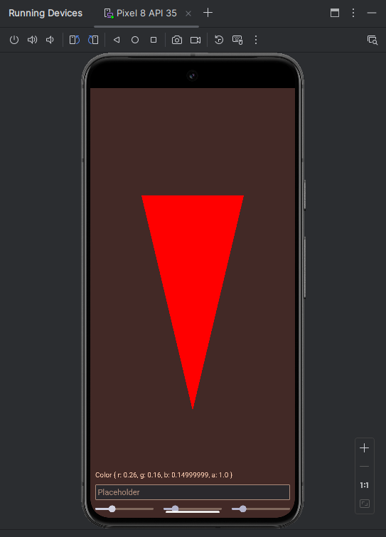
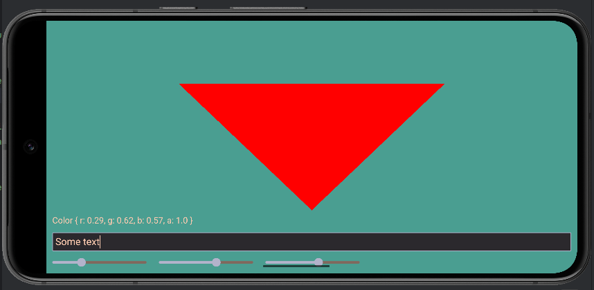
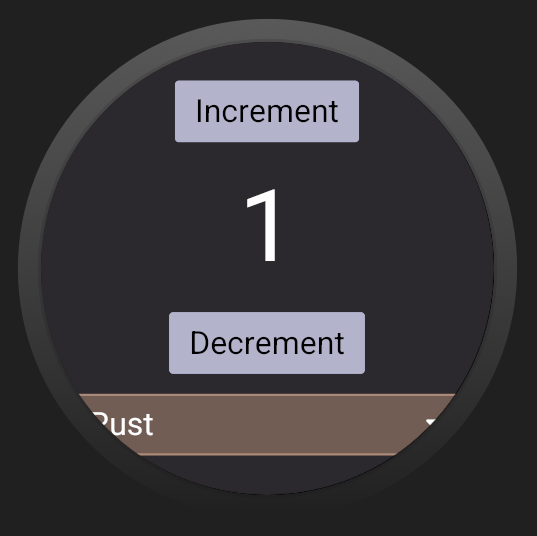
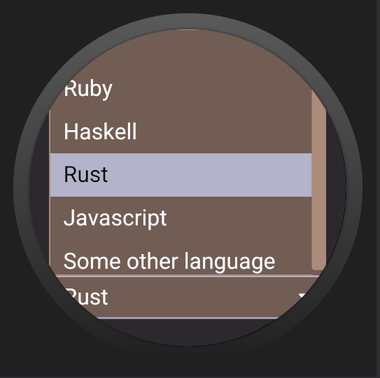
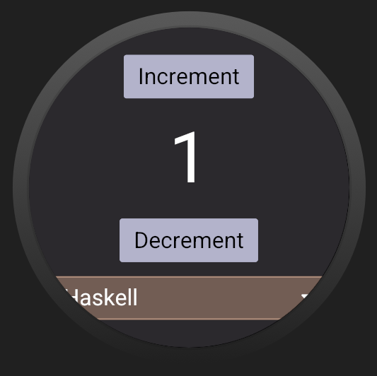
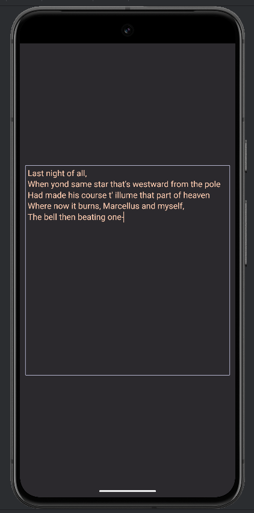

# Example of building android app with iced

There are [NativeActivity](./NativeActivity) and [GameActivity](./GameActivity) examples here.

Based on several other examples:
 - `na-mainloop` and `agdk-mainloop` from
   [android-activity](https://github.com/rust-mobile/android-activity/tree/v0.6.0/examples)
 - [na-winit-wgpu](https://github.com/rust-mobile/rust-android-examples/tree/main/na-winit-wgpu)
   from `rust-android-examples`
 - [integration](https://github.com/iced-rs/iced/tree/0.13.1/examples/integration)
   from `iced`


## Preview

iced integration example




You can also run most of the examples from iced.
For this omit the scene rendering part and set the background of the root container.


## Watch






## Text input

Text input partially works, unresolved issues:
- window doesn't resize on show/hide soft keyboard
- how to change input language of soft keyboard
- ime is not supported

Copy/paste and show/hide soft keyboard is implemented by calling Java




## Building and running

Check `android-activity` crate for detailed instructions.
During my tests I was running the following command and using android studio afterwards:

```bash
export ANDROID_NDK_HOME="path/to/ndk"
export ANDROID_HOME="path/to/sdk"

rustup target add x86_64-linux-android
cargo install cargo-ndk

cargo ndk -t x86_64 -o app/src/main/jniLibs/  build
```


My setup is the following:
- archlinux 6.9.6
- jdk-openjdk 22
- target api 35


## How it works

Thanks to `android-activity` we can already build android apps in Rust, and
key crates such as `winit` and `wgpu` also support building for android.
`iced` doesn't support android out of the box, but it can be integrated with
existing graphics pipelines, as shown in
[integration](https://github.com/iced-rs/iced/tree/0.13.1/examples/integration) example.
As a result, it was possible to convert existing example running `winit` + `wgpu` to
use `iced` on top.
